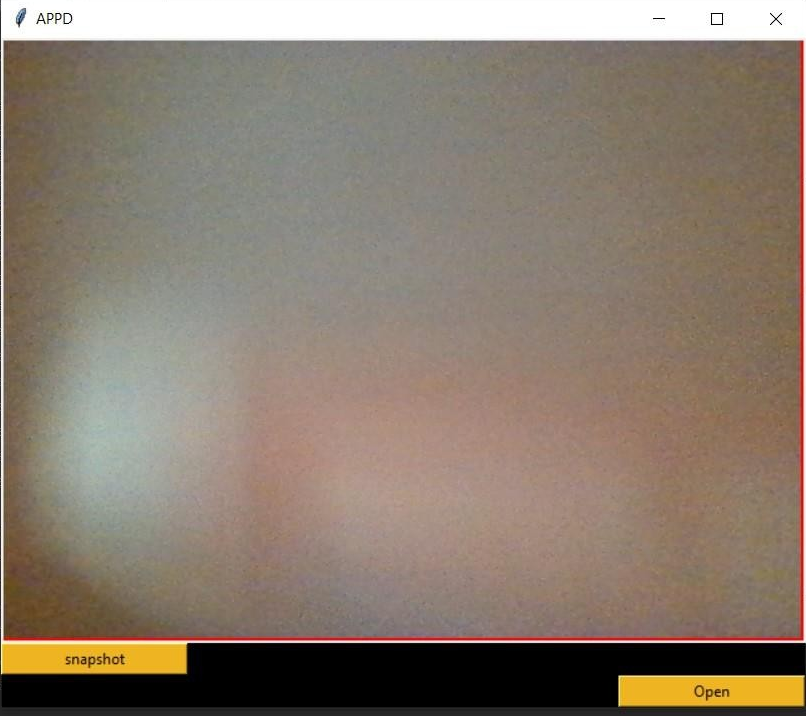
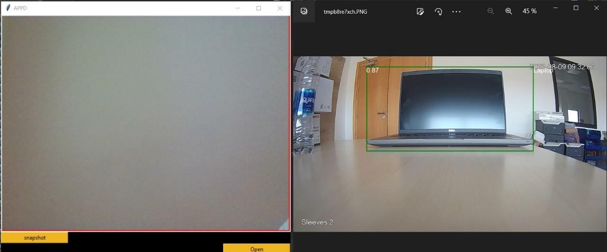

# **Object Detection App**  


This project is an interactive object detection application using OpenCV, YOLOv8, Tkinter, and Pillow. The app allows users to load images or video streams, detect objects, and visualize the results in real-time.

## **Features**
- **Real-Time Object Detection**: Utilizes YOLOv8 for high-accuracy object detection.
- **Interactive UI**: Built with Tkinter for an easy-to-use graphical interface.
- **Image Handling**: Powered by Pillow for image loading and processing.
- **Supports Images & Videos**: Detect objects in both images and live video streams.

---

## **Demo**


---

## **Technologies Used**
- **OpenCV**: For image and video processing.
- **YOLOv8**: Latest YOLO model for object detection.
- **Tkinter**: Python's built-in library for GUI development.
- **Pillow**: Image handling and manipulation in Python.

---

## **Installation**

1. Clone the repository:
    ```bash
    git clone https://github.com/yourusername/your-repo-name.git
    ```
2. Install required dependencies:
    ```bash
    pip install -r requirements.txt
    ```
3. Download the YOLOv8 model weights and place them in the `models/` directory.

---

## **Usage**

1. **Start the app**:
    ```bash
    python app.py
    ```
2. **Load an image or video** using the interface.
3. **Run detection** and view results directly in the app window.

---

## **Screenshots**

**Main Interface**  


**Detection Results**  


---

## **Contributing**

Feel free to submit a pull request if you want to contribute to the project! We welcome improvements and additional features.

---

## **License**
This project is licensed under the MIT License - see the [LICENSE](./LICENSE) file for details.

---

## **Contact**

For any questions or inquiries, please reach out via GitHub or email at [your.email@example.com](mailto:your.email@example.com).
